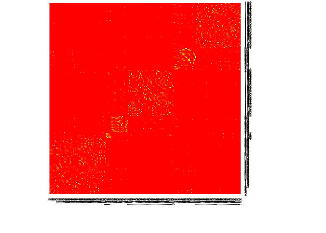
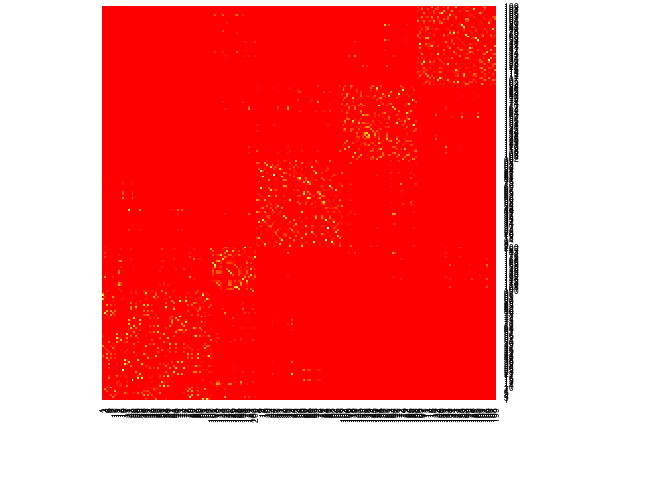
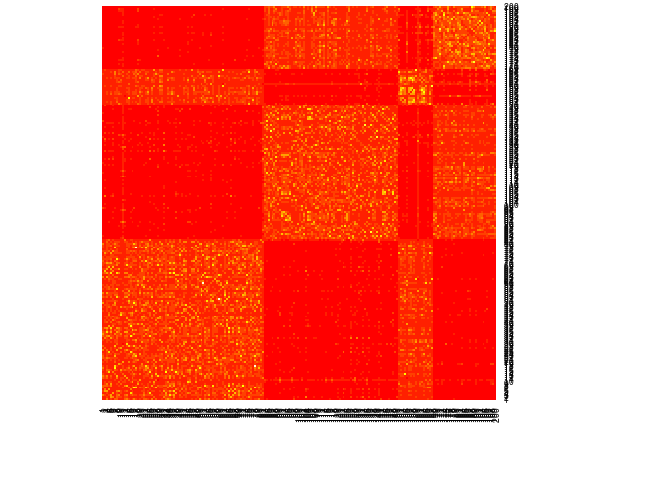

<!-- README.md is generated from README.Rmd. Please edit that file -->
SNFtool
=======

SNF tool is an R package for Similarity Network Fusion: taking multiple views of a network and merging them into a combined view.

This repo is a fork from <https://github.com/cran/SNFtool> with added functionality and documentation. More information on the original version can be found at <http://compbio.cs.toronto.edu/SNF/SNF/Software.html>

Installation
============

Install from github with:

``` r
if (packageVersion("devtools") < 1.6) {
  install.packages("devtools")
}
devtools::install_github("maxconway/SNFtool")
```

Usage examples
==============

First, we load the package and two example datasets. In this case, rows of both datasets represent patients, while columns represent gene expression and methylation respectively.

``` r
library(SNFtool)
data(Data1) # gene expression
data(Data2) # methylation
```

Next, we calculate distance matricies for both datasets. Here we use the default euclidian distance, but other measures may be appropriate to other datasets.

``` r
dist1 <- as.matrix(dist(Data1))
dist2 <- as.matrix(dist(Data2))
```

To convert distance matricies (where big values mean far apart) to similarity matricies, (where big values mean close together), we use `affinityMatirix`. `affinityMatrix` takes three arguments: a distance matrix, which we already have, and two parameters, `K` and `sigma`. `K` is number of neighbours, where affinities outside of the neighbourhood are set to zero, and affinities inside are normalized. `sigma` is a hyperparameter for the scaled exponential similarity kernel used to conduct the actual affinity calculation. Both of these parameters are chosen empirically.

``` r
W1 <- affinityMatrix(dist1, K = 20, sigma = 0.5)
W2 <- affinityMatrix(dist2, K = 20, sigma = 0.5)
```

Having calculated the similarity matricies, we can try clustering each matrix individually:

``` r
displayClustersWithHeatmap(W1, spectralClustering(W1, K = 3))
```



``` r
displayClustersWithHeatmap(W2, spectralClustering(W2, K = 3))
```



We can see that both matricies have some information about clusters in them. Wouldn't it be great if we could merge the two datasets to get one, richer, clustering? That's what SNF is for.

``` r
W = SNF(list(W1,W2), 20, 20)
displayClustersWithHeatmap(W, spectralClustering(W, K = 3))
```



More details
============

-   `vignette('Advanced_Usage_Examples', package = 'SNFtool')`
-   <http://compbio.cs.toronto.edu/SNF/SNF/Software.html>
-   <http://www.nature.com/nmeth/journal/v11/n3/full/nmeth.2810.html>
